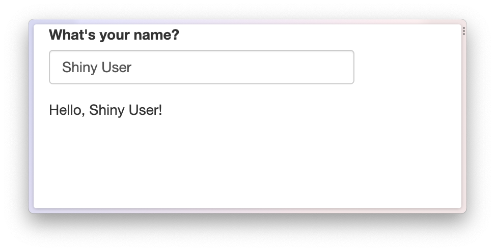

# epoxy in Shiny

## Templating in Shiny

[Shiny apps](https://shiny.posit.co/) are a great way to design
interactive web applications, and epoxy includes several functions to
help you weave reactive data into your apps.

Here are some ways you can use epoxy in your Shiny apps:

1.  Make the text portion of any element in your Shiny UI update
    dynamically.

2.  Weave reactive text into prose in your app.

3.  Build powerful templates using the [mustache templating
    language](https://mustache.github.io/).

Shiny already includes two reactive text outputs:

- [`shiny::uiOutput()`](https://rdrr.io/pkg/shiny/man/htmlOutput.html)
  (a.k.a.
  [`shiny::htmlOutput()`](https://rdrr.io/pkg/shiny/man/htmlOutput.html))
  and
- [`shiny::textOutput()`](https://rdrr.io/pkg/shiny/man/textOutput.html).

These are great for displaying reactive text in your app, but they have
some limitations:

- [`uiOutput()`](https://rdrr.io/pkg/shiny/man/htmlOutput.html) tends to
  move your UI code into the `server` function, making it harder to know
  the final structure of your UI.

- [`textOutput()`](https://rdrr.io/pkg/shiny/man/textOutput.html) is
  great for displaying reactive text, but it takes some work to get the
  spacing around the dynamic text *just right*.

In this article, we’ll learn how to use epoxy in Shiny apps and how
epoxy improves the experience of writing apps with dynamic text and
templates.

## Introducing epoxy in Shiny

### A basic Shiny app with textOutput()

Let’s start with an example Shiny app. It’s a simple but friendly app
that greets the user by name.

``` r

library(shiny)

ui <- fluidPage(
  textInput("name", "What's your name?"),
  p("Hello,", textOutput("greeting", inline = TRUE), "!")
)

server <- function(input, output) {
  output$greeting <- renderText(input$name)
}

shinyApp(ui, server)
```


This gets you pretty close to what you want, but you have to remember to
include `inline = TRUE` in
[`textOutput()`](https://rdrr.io/pkg/shiny/man/textOutput.html). There’s
also some extra space between the user’s name and the exclamation point
that you’d probably like to get rid of[^1].

### Setting up `ui_epoxy_html()`

Here’s how to approach dynamic text with
[`ui_epoxy_html()`](http:/pkg.garrickadenbuie.com/epoxy/preview/pr132/reference/ui_epoxy_html.md):

1.  Wrap a portion of your UI in
    [`ui_epoxy_html()`](http:/pkg.garrickadenbuie.com/epoxy/preview/pr132/reference/ui_epoxy_html.md)
    and give it an `.id`.

2.  Use `{{ name }}` syntax to define fields where the dynamic text
    should go.

3.  In your server code, assign
    [`render_epoxy()`](http:/pkg.garrickadenbuie.com/epoxy/preview/pr132/reference/render_epoxy.md)
    to an output matching the UI’s `.id` and pass in the reactive data
    as arguments with names matching the dynamic fields.

``` r

library(shiny)
library(epoxy)

ui <- fluidPage(
  textInput("name", "What's your name?"),
  ui_epoxy_html(           #<< Template wrapper
    .id = "greeting",      #<< Unique ID
    p("Hello, {{name}}!")  #<< Dynamic text
  )                        #<<
)

server <- function(input, output) {
  output$greeting <- render_epoxy( #<< Connect to template
    name = input$name              #<< Reactive data field
  )
}

shinyApp(ui, server)
```



### Default or error values

Another advantage of using
[`ui_epoxy_html()`](http:/pkg.garrickadenbuie.com/epoxy/preview/pr132/reference/ui_epoxy_html.md)
over [`textOutput()`](https://rdrr.io/pkg/shiny/man/textOutput.html) is
that you can set default values that appear immediately while your app
is loading or that are used when an error occurs.

In the next app, `name` is set to `"friend"` by default in
[`ui_epoxy_html()`](http:/pkg.garrickadenbuie.com/epoxy/preview/pr132/reference/ui_epoxy_html.md),
and on the server side I’ve also added a
[`validate()`](https://rdrr.io/pkg/shiny/man/validate.html) call
indicating that we need a name with at least 2 characters.

``` r

library(shiny)
library(epoxy)

ui <- fluidPage(
  textInput("name", "What's your name?"),
  ui_epoxy_html(
    .id = "greeting",
    p("Hello, {{name}}!"),
    name = "friend"
  )
)

server <- function(input, output) {
  name <- reactive({
    validate(need(
      nchar(input$name) > 2,
      "Name must be more than 2 characters."
    ))
    input$name
  })

  output$greeting <- render_epoxy(
    name = name()
  )
}

shinyApp(ui, server)
```

If the user hasn’t yet entered a name of more than 2 characters, the
text for the `name` field will use the default value and will have a red
squiggle below it. Hovering over the squiggle reveals the error message.


### A few more things about `ui_epoxy_html()`

First, you can reference the same reactive value, e.g. `{{ name }}`, as
many times as you want in your template. This value can also go just
about anywhere in your UI. as long as it’s okay to put a `<span>` around
the text[^2].

Example app code

``` r

library(shiny)
library(epoxy)

ui <- fluidPage(
  textInput("name", "What's your name?"),
  ui_epoxy_html(
    .id = "greeting",
    selectInput(
      inputId = "color",
      label = "What's your favorite color, {{ name }}?",
      choices = c("red", "green", "blue", "purple", "yellow")
    ),
    name = "friend"
  )
)

server <- function(input, output) {
  output$greeting <- render_epoxy(
    name = input$name
  )
}

shinyApp(ui, server)
```


You can use `{{ <markup> <expr> }}` syntax[^3] from
[`epoxy_html()`](http:/pkg.garrickadenbuie.com/epoxy/preview/pr132/reference/epoxy.md),
which makes it possible to determine which HTML element and class is
used to contain the dynamic text[^4]. If you send an array of values to
this reactive field, the tag is used as a template, making it easy to do
things like dynamically update a list.

Example app code

``` r

library(shiny)
library(epoxy)

ui <- fluidPage(
  textInput("faves", "What are your favorite fruits?"),
  helpText("Enter a list of comma-separated fruits."),
  ui_epoxy_html(
    .id = "fruit_list",
    tags$ul("{{ li fruits }}"),
    fruits = "favorite fruits"
  )
)

server <- function(input, output) {
  fruits <- reactive({
    validate(need(
      nzchar(input$faves),
      "Please share your favorite fruits."
    ))
    fruits <- trimws(strsplit(input$faves, ",\\s*")[[1]])
    fruits[nzchar(fruits)]
  })

  output$fruit_list <- render_epoxy(
    fruits = fruits()
  )
}

shinyApp(ui, server)
```


Three more quick things about
[`ui_epoxy_html()`](http:/pkg.garrickadenbuie.com/epoxy/preview/pr132/reference/ui_epoxy_html.md):

1.  It assumes that bare character strings are HTML, so you don’t have
    to worry about adding
    [`HTML()`](https://rstudio.github.io/htmltools/reference/HTML.html)
    all over the place.

2.  The replacement text is *not assumed to be HTML*, by default, to
    save you from accidentally injecting unsafe HTML from user input
    into your app. If you’re very certain that a field will only contain
    safe HTML, you can mark it as safe for HTML with three braces,
    e.g. `{{{ <expr> }}}`.

3.  The replacement text is sent as bare text or HTML, making it more
    like [`textOutput()`](https://rdrr.io/pkg/shiny/man/textOutput.html)
    than [`uiOutput()`](https://rdrr.io/pkg/shiny/man/htmlOutput.html).
    In particular, where
    [`uiOutput()`](https://rdrr.io/pkg/shiny/man/htmlOutput.html) would
    allow you to send arbitary widgets based on
    [htmlwidgets](https://github.com/ramnathv/htmlwidgets) or
    [htmltools](https://github.com/rstudio/htmltools),
    [`ui_epoxy_html()`](http:/pkg.garrickadenbuie.com/epoxy/preview/pr132/reference/ui_epoxy_html.md)
    only ever sends the bare text or HTML.

## Connecting epoxy with a reactive data frame

One of my favorite use cases for epoxy’s Shiny functions is to create a
UI template that’s filled in by a row in a data frame. In this pattern,
the app’s inputs are combined in a reactive expression that filters the
data frame down to a single row. Then, that row is sent via
[`render_epoxy()`](http:/pkg.garrickadenbuie.com/epoxy/preview/pr132/reference/render_epoxy.md)
to the UI, where it’s dynamically injected into the template UI.

Here’s a small example using epoxy’s built in `bechdel` data set, a
small data set with the 10 highest-rated movies that pass the [Bechdel
test](https://en.wikipedia.org/wiki/Bechdel_test). In this app, the user
picks a movie and the template below is filled out with information from
the data set for that movie.

``` r

library(shiny)
library(epoxy)

movie_choices <- bechdel$imdb_id
names(movie_choices) <- bechdel$title

ui <- fixedPage(
  selectInput("movie", "Pick a movie", choices = movie_choices),
  ui_epoxy_html(
    .id = "movie_info",
    p(
      "{{ em title }} was released",
      "in {{ strong year }}.",
      "It was directed by {{ director }}",
      "and was rated {{ rated }}."
    )
  )
)

server <- function(input, output, session) {
  movie <- reactive({
    # Use the inputs to filter a single row
    bechdel[bechdel$imdb_id == input$movie, ]
  })

  # Pass the reactive data frame to
  # the .list argument of render_epoxy()
  output$movie_info <- render_epoxy(.list = movie())
}

shinyApp(ui, server)
```


Notice that instead of passing named arguments for each field to
[`render_epoxy()`](http:/pkg.garrickadenbuie.com/epoxy/preview/pr132/reference/render_epoxy.md),
we pass the entire data frame to the `.list` argument.

``` r

render_epoxy(.list = movie())
```

You can use this same pattern with a list in a
[`reactiveVal()`](https://rdrr.io/pkg/shiny/man/reactiveVal.html), a
[`reactive()`](https://rdrr.io/pkg/shiny/man/reactive.html) that returns
a data frame, a list or a list-like object, or a
[`reactiveValues()`](https://rdrr.io/pkg/shiny/man/reactiveValues.html)
list. And `.list` can coexist with named expressions.

``` r

render_epoxy(
  name = input$name,
  .list = movie()
)
```

If you want to build the entire list within a single reactive
expression, set `.list` equal to the expression, wrapped in braces:

``` r

render_epoxy(.list = {
  list(
    name = input$name,
    age = input$age
  )
})
```

## Markdown templates

If you’re using epoxy to write data-driven prose, you might want to use
markdown for your templates, rather than writing in HTML.
[`ui_epoxy_markdown()`](http:/pkg.garrickadenbuie.com/epoxy/preview/pr132/reference/ui_epoxy_markdown.md)
is a version of
[`ui_epoxy_html()`](http:/pkg.garrickadenbuie.com/epoxy/preview/pr132/reference/ui_epoxy_html.md)
that uses markdown syntax instead of HTML syntax[^5].

Let’s revisit our movie app from the last example, but this time using
markdown for the template.

``` r

library(shiny)
library(epoxy)

movie_choices <- bechdel$imdb_id
names(movie_choices) <- bechdel$title

ui <- fixedPage(
  selectInput("movie", "Pick a movie", choices = movie_choices),
  ui_epoxy_markdown(
    .id = "movie_info",
    "_{{ title }}_ was released",
    "in **{{ year }}**.",
    "It was directed by {{ director }}",
    "and was rated {{ rated }}."
  )
)

server <- function(input, output, session) {
  movie <- reactive({
    bechdel[bechdel$imdb_id == input$movie, ]
  })

  output$movie_info <- render_epoxy(.list = movie())
}

shinyApp(ui, server)
```


For an even more involved example, try the epoxy markdown example app

``` r

run_epoxy_example_app("ui_epoxy_markdown")
```


## Mustache templates

For more complex templates, you might want to use a template language
like [Mustache](https://mustache.github.io/). In R, we know this syntax
from the [whisker](https://github.com/edwindj/whisker) package.

[`ui_epoxy_mustache()`](http:/pkg.garrickadenbuie.com/epoxy/preview/pr132/reference/ui_epoxy_mustache.md)[^6]
wraps the Mustache language, letting you blend typical
[shiny](https://shiny.posit.co/) and
[htmltools](https://github.com/rstudio/htmltools) UI with the mustache
template.

When would you use
[`ui_epoxy_mustache()`](http:/pkg.garrickadenbuie.com/epoxy/preview/pr132/reference/ui_epoxy_mustache.md)
instead of
[`ui_epoxy_html()`](http:/pkg.garrickadenbuie.com/epoxy/preview/pr132/reference/ui_epoxy_html.md)?

- If your template variables are used as HTML attributes, e.g. in links
  or images (via the `href` or `src` attributes).

- If you want to use mustache’s conditional logic,
  e.g. `{{#<expr>}} ... {{/<expr>}}`.

Let’s revist our favorite fruits example app [from
earlier](#few-more-things).

``` r

library(shiny)
library(epoxy)

ui <- fluidPage(
  textInput("faves", "What are your favorite fruits?"),
  ui_epoxy_mustache(
    id = "fruit_list",
    tags$ul(
      # If fruits is not empty, wrap into list items
      "{{#fruits}}",
      tags$li("{{.}}"),
      "{{/fruits}}",
      # If fruits is empty, show a help message
      "{{^fruits}}",
      tags$li(
        class = "text-muted",
        "Enter a list of comma-separated fruits."
      ),
      "{{/fruits}}"
    )
  )
)

server <- function(input, output) {
  fruits <- reactive({
    req(input$faves)
    fruits <- trimws(strsplit(input$faves, ",\\s*")[[1]])
    fruits[nzchar(fruits)]
  })

  output$fruit_list <- render_epoxy(
    fruits = fruits()
  )
}

shinyApp(ui, server)
```

This app use’s mustache’s conditional logic to show a help message when
no fruits are entered.


And it uses mustache’s looping syntax to show a list of fruits when
fruits are entered.


You can find a more detailed example in the epoxy mustache example app.

``` r

run_epoxy_example_app("ui_epoxy_mustache")
```

One important thing to note about
[`ui_epoxy_mustache()`](http:/pkg.garrickadenbuie.com/epoxy/preview/pr132/reference/ui_epoxy_mustache.md)
is that, unlike
[`ui_epoxy_html()`](http:/pkg.garrickadenbuie.com/epoxy/preview/pr132/reference/ui_epoxy_html.md),
then entire template is re-rendered (in the browser) whenever a reactive
source updates. So it’d be better to use smaller, localized templates
than to wrap your entire app in
[`ui_epoxy_mustache()`](http:/pkg.garrickadenbuie.com/epoxy/preview/pr132/reference/ui_epoxy_mustache.md).

[^1]: To remove the spacing between
    [`textOutput()`](https://rdrr.io/pkg/shiny/man/textOutput.html) and
    the next character after it, you need to use the `.noWS` argument of
    a tag function.
    [`textOutput()`](https://rdrr.io/pkg/shiny/man/textOutput.html)
    doesn’t expose this argument though, so you have to give it a custom
    container function, such as
    `container = function(x) span(x, .noWS = "after")`.

[^2]: For
    [`ui_epoxy_html()`](http:/pkg.garrickadenbuie.com/epoxy/preview/pr132/reference/ui_epoxy_html.md)
    this means you can’t dynamically update attribute values, like the
    `href` attribute of an `<a>` tag. You *can do that* with
    [`ui_epoxy_mustache()`](http:/pkg.garrickadenbuie.com/epoxy/preview/pr132/reference/ui_epoxy_mustache.md)
    though, which we’ll cover later. Or you can write the full HTML on
    the server side with `htmltools::tags$a()`.

[^3]: Um, so this is awkward. But I’m using `<..>` to denote things
    **you** should replace and the `{{ .. }}` to denote things **epoxy**
    will replace. I hope that’s not too confusing. Here’s a real world
    example: `{{ strong.text-success name }}`.

[^4]: Unfortunately, you can’t use the inline formatting syntax from
    [`epoxy_transform_inline()`](http:/pkg.garrickadenbuie.com/epoxy/preview/pr132/reference/epoxy_transform_inline.md)
    in
    [`ui_epoxy_html()`](http:/pkg.garrickadenbuie.com/epoxy/preview/pr132/reference/ui_epoxy_html.md),
    e.g. `{{ .bold name}}` wraps the `name` field in a `<span>` with
    `class = "bold"` rather than a `<strong>` tag.

[^5]: It also has the same limitations: you can only use template fields
    in the text portions of your markdown. That’s mostly everywhere, but
    notably `` won’t work.

[^6]: Or
    [`ui_epoxy_whisker()`](http:/pkg.garrickadenbuie.com/epoxy/preview/pr132/reference/ui_epoxy_mustache.md)
    if you prefer.
