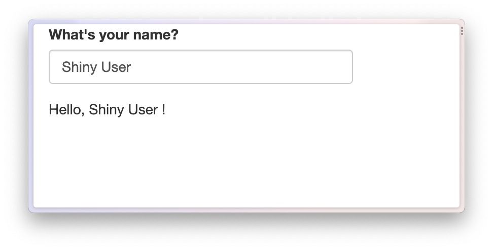
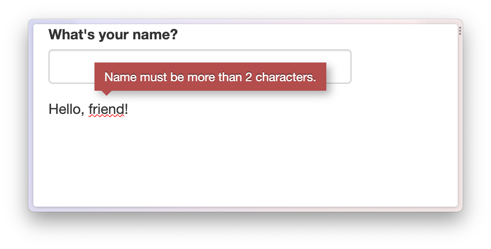
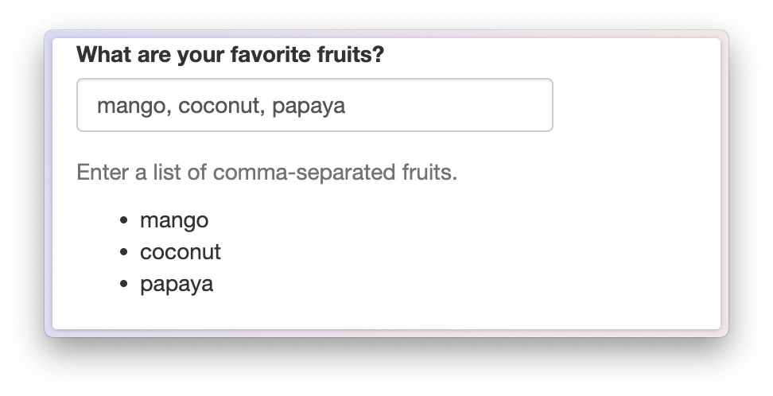

[shiny]: https://shiny.posit.co/
[mustache]: https://mustache.github.io/

```{r, include = FALSE}
knitr::opts_chunk$set(
  collapse = TRUE,
  comment = "#>"
)
library(shiny)
library(epoxy)
```

## Templating in Shiny

[Shiny apps][shiny] are a great way to design interactive web applications,
and epoxy includes several functions
to help you weave reactive data into your apps.

Here are some ways you can use epoxy in your Shiny apps:

1. Make the text portion of any element in your Shiny UI update dynamically.

2. Weave reactive text into prose in your app.

3. Build powerful templates using the [mustache templating language][mustache].


Shiny already includes two reactive text outputs:

* `shiny::uiOutput()` (a.k.a. `shiny::htmlOutput()`) and
* `shiny::textOutput()`.

These are great for displaying reactive text in your app,
but they have some limitations:

* `uiOutput()` tends to move your UI code into the `server` function,
  making it harder to know the final structure of your UI.

* `textOutput()` is great for displaying reactive text,
  but it takes some work to get the spacing around the dynamic text
  _just right_.

In this article, we'll learn how to use epoxy in Shiny apps
and how epoxy improves the experience of writing apps
with dynamic text and templates.

## Introducing epoxy in Shiny

### A basic Shiny app with textOutput()

Let's start with an example Shiny app.
It's a simple but friendly app that greets the user by name.

``` r
library(shiny)

ui <- fluidPage(
  textInput("name", "What's your name?"),
  p("Hello,", textOutput("greeting", inline = TRUE), "!")
)

server <- function(input, output) {
  output$greeting <- renderText(input$name)
}

shinyApp(ui, server)
```



This gets you pretty close to what you want,
but you have to remember to include `inline = TRUE` in `textOutput()`.
There's also some extra space
between the user's name and the exclamation point
that you'd probably like to get rid of[^container-arg].

[^container-arg]: To remove the spacing between `textOutput()` and the next character after it, you need to use the `.noWS` argument of a tag function. `textOutput()` doesn't expose this argument though, so you have to give it a custom container function, such as `container = function(x) span(x, .noWS = "after")`.

### Setting up `ui_epoxy_html()`

Here's how to approach dynamic text with `ui_epoxy_html()`:

1. Wrap a portion of your UI in `ui_epoxy_html()` and give it an `.id`.

2. Use `{{ name }}` syntax to define fields where the dynamic text should go.

3. In your server code, assign `render_epoxy()` to an output matching the UI's
   `.id` and pass in the reactive data as arguments with names matching the
   dynamic fields.

``` r
library(shiny)
library(epoxy)

ui <- fluidPage(
  textInput("name", "What's your name?"),
  ui_epoxy_html(           #<< Template wrapper
    .id = "greeting",      #<< Unique ID
    p("Hello, {{name}}!")  #<< Dynamic text
  )                        #<<
)

server <- function(input, output) {
  output$greeting <- render_epoxy( #<< Connect to template
    name = input$name              #<< Reactive data field
  )
}

shinyApp(ui, server)
```


### Default or error values

Another advantage of using `ui_epoxy_html()` over `textOutput()`
is that you can set default values that appear immediately
while your app is loading
or that are used when an error occurs.

In the next app,
`name` is set to `"friend"` by default in `ui_epoxy_html()`,
and on the server side I've also added a `validate()` call
indicating that we need a name with at least 2 characters.

``` r
library(shiny)
library(epoxy)

ui <- fluidPage(
  textInput("name", "What's your name?"),
  ui_epoxy_html(
    .id = "greeting",
    p("Hello, {{name}}!"),
    name = "friend"
  )
)

server <- function(input, output) {
  name <- reactive({
    validate(need(
      nchar(input$name) > 2,
      "Name must be more than 2 characters."
    ))
    input$name
  })

  output$greeting <- render_epoxy(
    name = name()
  )
}

shinyApp(ui, server)
```

If the user hasn't yet entered a name of more than 2 characters,
the text for the `name` field will use the default value
and will have a red squiggle below it.
Hovering over the squiggle reveals the error message.



### A few more things about `ui_epoxy_html()`

First, you can reference the same reactive value,
e.g. `{{ name }}`,
as many times as you want in your template.
This value can also go just about anywhere in your UI.
as long as it's okay to put a `<span>` around the text[^not-attributes].

[^not-attributes]: For `ui_epoxy_html()` this means you can't dynamically update attribute values, like the `href` attribute of an `<a>` tag. You _can do that_ with `ui_epoxy_mustache()` though, which we'll cover later. Or you can write the full HTML on the server side with `htmltools::tags$a()`.

<details><summary>Example app code</summary>

``` r
library(shiny)
library(epoxy)

ui <- fluidPage(
  textInput("name", "What's your name?"),
  ui_epoxy_html(
    .id = "greeting",
    selectInput(
      inputId = "color",
      label = "What's your favorite color, {{ name }}?",
      choices = c("red", "green", "blue", "purple", "yellow")
    ),
    name = "friend"
  )
)

server <- function(input, output) {
  output$greeting <- render_epoxy(
    name = input$name
  )
}

shinyApp(ui, server)
```

</details>


You can use `{{ <markup> <expr> }}` syntax[^not-inline] from `epoxy_html()`,
which makes it possible to determine which HTML element and class is used
to contain the dynamic text.
If you send an array of values to this reactive field,
the tag is used as a template,
making it easy to do things like dynamically update a list.

[^not-inline]: Unfortunately, you can't use the inline formatting syntax from `epoxy_transform_inline()` in `ui_epoxy_html()`, e.g. `{{ .bold name}}` wraps the `name` field in a `<span>` with `class = "bold"` rather than a `<strong>` tag.

<details><summary>Example app code</summary>

``` r
library(shiny)
library(epoxy)

ui <- fluidPage(
  textInput("faves", "What are your favorite fruits?"),
  helpText("Enter a list of comma-separated fruits."),
  ui_epoxy_html(
    .id = "fruit_list",
    tags$ul("{{ li fruits }}"),
    fruits = "favorite fruits"
  )
)

server <- function(input, output) {
  fruits <- reactive({
    validate(need(
      nzchar(input$faves),
      "Please share your favorite fruits."
    ))
    fruits <- trimws(strsplit(input$faves, ",\\s*")[[1]])
    fruits[nzchar(fruits)]
  })

  output$fruit_list <- render_epoxy(
    fruits = fruits()
  )
}

shinyApp(ui, server)
```

</details>



Three more quick things about `ui_epoxy_html()`:

1. It assumes that bare character strings are HTML, so you don't have to worry
  about adding `HTML()` all over the place.

2. The replacement text is _not assumed to be HTML_, by default, to save you
   from accidentally injecting unsafe HTML from user input into your app. If
   you're very certain that a field will only contain safe HTML, you can mark it
   as safe for HTML with three braces, e.g. `{{{ <expr> }}}`.

3. The replacement text is sent as bare text or HTML,
   making it more like `textOutput()` than `uiOutput()`.
   In particular, where `uiOutput()` would allow you to send arbitary
   widgets based on `{htmlwidgets}` or `{htmltools}`,
   `ui_epoxy_html()` only ever sends the bare text or HTML.

### Connecting epoxy with a reactive data frame

``` r
library(shiny)
library(epoxy)

movie_choices <- bechdel$imdb_id
names(movie_choices) <- bechdel$title

ui <- fixedPage(
  selectInput("movie", "Pick a movie", choices = movie_choices),
  ui_epoxy_html(
    .id = "movie_info",
    p(
      "{{ em title }} was released in {{ strong year }}.",
      "It was directed by {{ director }} and rated {{ rated }}."
    )
  )
)

server <- function(input, output, session) {
  movie <- reactive({
    bechdel[bechdel$imdb_id == input$movie, ]
  })

  output$movie_info <- render_epoxy(.list = movie())
}

shinyApp(ui, server)
```

## Cut this, cut this, cut this

Sorry! I'm still working on this article.
In the mean time,
check out the packaged Shiny app examples using `run_epoxy_example_app()`.
Or read about the related Shiny UI and server functions:

* `ui_epoxy_html()`
* `ui_epoxy_mustache()`
* `render_epoxy()`

