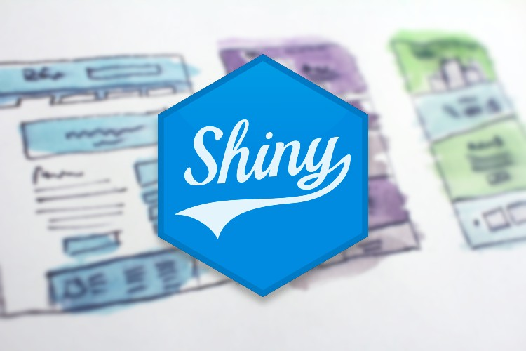

```{r, include = FALSE}
knitr::opts_chunk$set(
	collapse = TRUE,
	comment = "#>"
)
```

```{css echo=FALSE}
.row > main {
  width: 100% !important;
  margin-left: auto;
  margin-right: auto;
}
.card h3.card-title {
  margin-top: 0;
}
```

## Use epoxy

```{=html}
<div class="container">
<div class="row d-grid" style="grid-template-columns: repeat(auto-fill, minmax(325px, 1fr)); gap: 1em;">
<!-- card -->
<div class="col p-0">
<div class="card card-as-link">

<div class="card-body">
<h3 class="card-title"><a href="epoxy-report.html" class="card-primary-link card-header-link text-decoration-none">epoxy in Reports</a></h3>
<p class="card-text">Use epoxy to blend data and prose with inline templating and formatting.</p>
</div>
</div>
</div>
<!-- card -->
<div class="col p-0">
<div class="card card-as-link">

<div class="card-body">
<h3 class="card-title"><a href="epoxy-shiny.html" class="card-primary-link card-header-link text-decoration-none">epoxy in Shiny Apps</a></h3>
<p class="card-text">Use epoxy for reactive templating and targeted updates in Shiny apps.</p>
</div>
</div>
</div>
<!-- card -->
<div class="col p-0">
<div class="card card-as-link">

<div class="card-body">
<h3 class="card-title"><a href="epoxy-script.html" class="card-primary-link card-header-link text-decoration-none">epoxy in R scripts</a></h3>
<p class="card-text">Use epoxy in your R scripts, anywhere you've used glue.</p>
</div>
</div>
</div>
</div>
</div>
```
